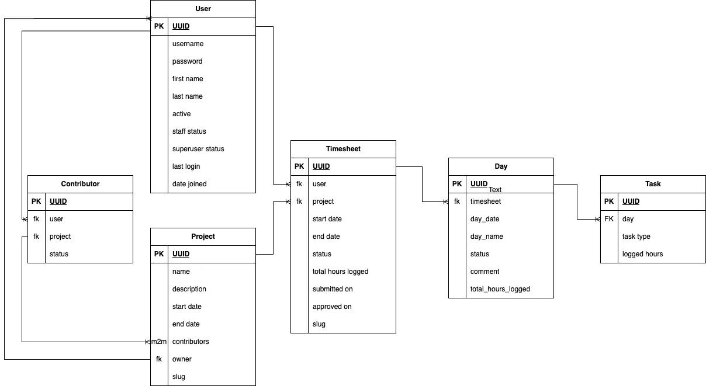

# Bike Pals

## Mission Statement:
Yelen Log is a timesheet management application I developed to track my working hours for freelance projects.
The name "Yelen" is inspired by the Hungarian word jelen, meaning "now" or "present," reflecting a focus on the current moment. "Log" refers to recording or capturing data — together, Yelen Log represents the act of logging time as it happens.

## Product Backlog:
- The project was created based on the [YelenLog project board](https://github.com/users/demetermarcell/projects/6).

## Data Model:

## UX Design:

## Features
### User Permissions:
 - Admin:
  - Access to Django admin panel for backend management
  - Full access to all data and functionality
    - create and manage projects
    - create and manage users
    - create and manage contributors
    - create and manage timesheets
    - create and manage days
    - create and manage tasks
  - Assign users to projects as contributors or owner.
- Project Owner:
 - Access to My Projects dashboard
 - Access to Project Timesheets
 - Ability to approve and reject submitted timesheets from project contributors
 - Ability to see the list of project contributors
- Contributor:
 - Access to Assigned projects dasboard
 - Ability to access project view for assigned projects
 - Ability to create, edit and submit timesheets
 - Ability to reopen rejected timesheets

## Testing
 I have completed a full regression testing, syntax validation and Lighthouse automated testing.
 Manual testing have been completed based on the BDD scenarios created for all user stories in Gherkin syntax.
 Please see the detailed test documentation and their results below:

### Validator Testing
 - W3C HTML Validator Results: All Passed
  - Login: [LINK]()
  - Signup: [LINK]()
  - Logout [LINK]()
  - Project Dashboard: [LINK]()
  - Project View: [LINK]()
  - Timesheet View: [LINK]()
  - Timesheet Edit: [LINK]()
- CSS Validator Results: Jigsaw
  - Login: [LINK]()
  - Signup: [LINK]()
  - Logout [LINK]()
  - Project Dashboard: [LINK]()
  - Project View: [LINK]()
  - Timesheet View: [LINK]()
  - Timesheet Edit: [LINK]()
- Javascript Validator: 
  All Javascript code was validated by [JS Hint](https://jshint.com/) No erorrs were found, all warnings are related to ES6 version.
- PEP8
 - PEP8 Checking have been completed on all python files in the repository. The only issues were E501 line too long errors. They do not cause runtime issues.

### Automated Testing
- Lighthouse Results:
  - Login: 
    - 
    - 
  - Signup:
  - Logout:
  - Project Dashboard:
  - Project View:
  - Timesheet View:
  - Timesheet Edit:

### Manual Testing

Summary of test results:
(detailed test case descriptions are attached to the user stories)

| #  | Test Case                                         | Expected Result                                                                       | Result |
|----|---------------------------------------------------|---------------------------------------------------------------------------------------|--------|
| 1  | Testing navbar links on index.html               | As per user story test cases                                                         | Pass   |
| 2  | Testing navbar links on prices.html              | As per user story test cases                                                         | Pass   |
| 3  | Testing navbar links on bookastand.html          | As per user story test cases                                                         | Pass   |
| 4  | Testing navbar links on success.html             | As per user story test cases                                                         | Pass   |
| 5  | Testing social media links on index.html         | Opening social media sites in new tab                                                | Pass   |
| 6  | Testing social media links on prices.html        | Opening social media sites in new tab                                                | Pass   |
| 7  | Testing social media links on bookastand.html    | Opening social media sites in new tab                                                | Pass   |
| 8  | Testing social media links on success.html       | Opening social media sites in new tab                                                | Pass   |
| 9  | Testing services price card link on index.html   | Redirecting user to prices.html                                                      | Pass   |
| 10 | Testing services book a stand card link on index.html | Redirecting user to bookastand.html                                                 | Pass   |
| 11 | Testing form validation with incomplete data on bookastand.html | System blocks user to submit the form without filling all the mandatory attributes | Pass   |
| 12 | Testing form validation with complete data on bookastand.html | User gets redirected to success.html                                               | Pass   |
| 13 | Testing Return to Home Page button on success.html | User gets redirected to index.html                                                 | Pass   |
| 14 | Testing Bronze package modal on prices.html      | Modal pops up when selecting the services                                            | Pass   |
| 15 | Testing Silver package modal on prices.html      | Modal pops up when selecting the services                                            | Pass   |
| 16 | Testing Gold package modal on prices.html        | Modal pops up when selecting the services                                            | Pass   |
| 17 | Testing Platinum package modal on prices.html    | Modal pops up when selecting the services                                            | Pass   |

### Unfixed Bugs
 - 
## Deployment
- The repository is stored on my personal GitHub account as a public repository.
- Preparation steps before the deployment:
 - DEBUG = False in the settings.py of the project.
 - gunicorn was installed to the project, Procfile was created with the following line: web: gunicorn codestar.wsgi
 - .python-version file was created to let Heroku identify which python version is used on the project.
 - Whitenoise was installed to handle static files efficiently.
- The app was deployed to Heroku as per steps below:
    - Login to personal Heroku account.
    - Select New -> Create new app from top right segment of the screen.
    - Set unique name to the app and select location, then hit Create app.
    - After creating app, navigate to Settings from the top navigation.
    - Select Reveal Config Vars and add the following key-value combinations:
        - DATABASE_URL - private url received after instance was created with the PostgreSQL from Code Institute 
        - SECRET_KEY - secret key of the specific Django project 
    - Navigate to the Deploy section from the top navigation.
    - Select GitHub as your Deployment Method.
    - Set the name of your repository and hit Search
    - Connect your repository to the Heroku app.
    - On the "Manual deploy" section of the screen, select the correct branch and hit "Deploy Branch"
    - Navigate to Resources/Eco Dynos and make sure gunicorn is added to the list.
    - Resources/ Add-on Services should be empty
    
## Credits
### Content
- Data Model, Logic and Requirements were created by Marcell Demeter.
- User stories were created by Marcell Demeter with the aid of [ChatGPT](https://chatgpt.com/)
- Text content was created by Marcell Demeter with the aid of [ChatGPT](https://chatgpt.com/)
- Code was created by Marcell Demeter with the aid of [ChatGPT](https://chatgpt.com/)
- Resources used:
    - Allauth - user management, authentiaction
    - Summernote - Adds a rich WYSIWYG editor (Summernote) to Django admin and forms for editing HTML content.
    - Gunicorn - A production-grade WSGI HTTP server.
    - Crispy forms - Enhanced Django form rendering capabilities
    - Crispy boottrap5 - Simplified form rendering for CrispyForms
    - Whitenoise - Serves static files efficiently in production directly from the Django app
    - psycopg2 - 	PostgreSQL adapter

### Media
- Favicon was converted with [Favicon.io](https://favicon.io/)
- Logo file was AI generated by ChatGPT.
- Mockups were created by Marcell Demeter