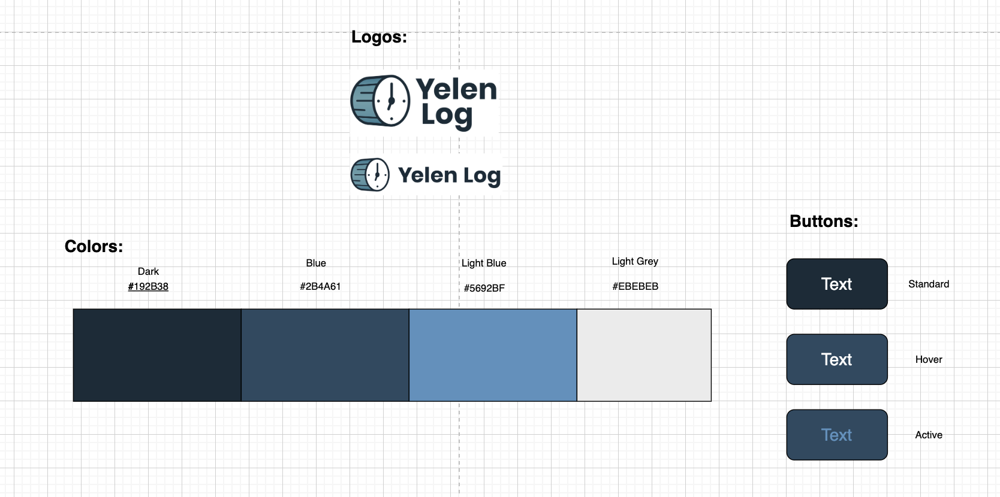
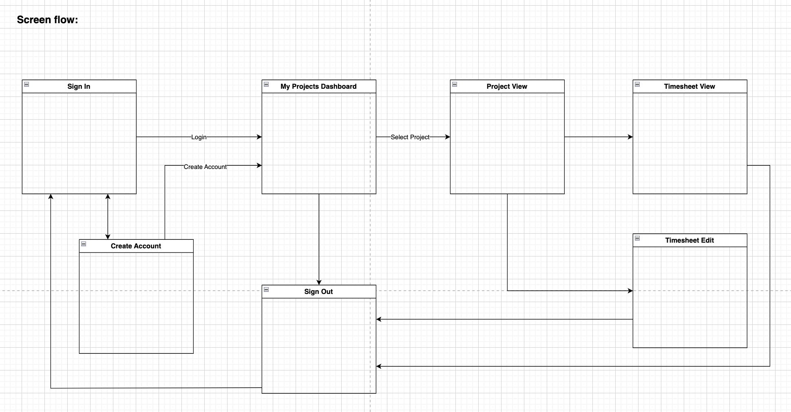
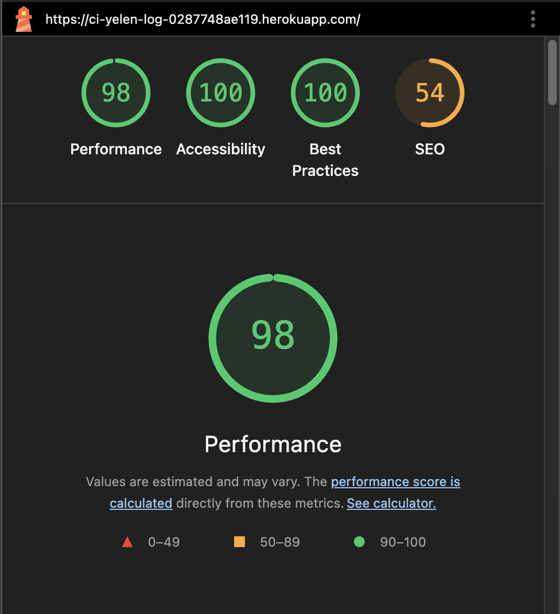
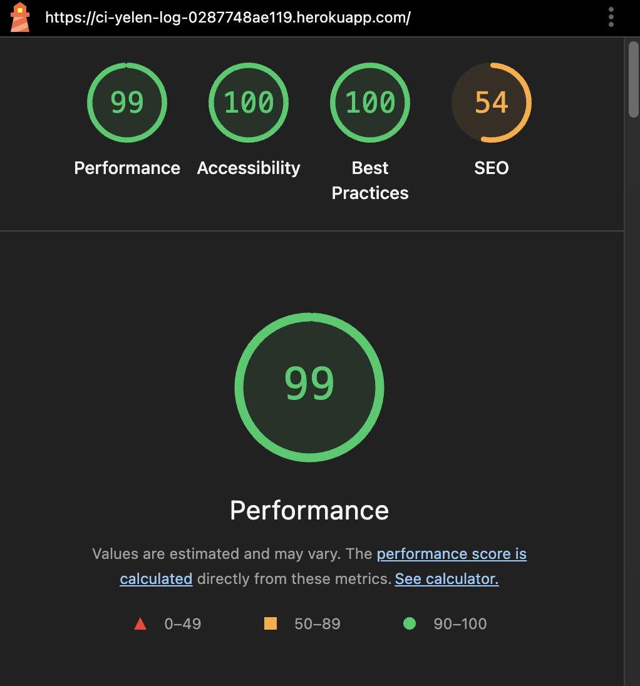

# Bike Pals

## Mission Statement:
Yelen Log is a timesheet management application I developed to track my working hours for freelance projects.
The name "Yelen" is inspired by the Hungarian word jelen, meaning "now" or "present," reflecting a focus on the current moment. "Log" refers to recording or capturing data — together, Yelen Log represents the act of logging time as it happens.

## Product Backlog:
- The project was created based on the [YelenLog project board](https://github.com/users/demetermarcell/projects/6).

## Data Model:

- Timesheet State Flow:  

## UX Design:
 - UI Elements: 
 - High Level Screenflow: 
 - Mockups: missing
 - The application is designed mainly for desktop use, however it is responsive for mobile devices as well.

## Features
### User Permissions:
 - Admin:
  - Access to Django admin panel for backend management
  - Full access to all data and functionality
    - create and manage projects
    - create and manage users
    - create and manage contributors
    - create and manage timesheets
    - create and manage days
    - create and manage tasks
  - Assign users to projects as contributors or owner.
- Project Owner:
 - Access to My Projects dashboard
 - Access to Project Timesheets
 - Ability to approve and reject submitted timesheets from project contributors
 - Ability to see the list of project contributors
- Contributor:
 - Access to Assigned projects dasboard
 - Ability to access project view for assigned projects
 - Ability to create, edit and submit timesheets
 - Ability to reopen rejected timesheets

 ## Screens:
 - screenshots - missing

## Testing
 I have completed a full regression testing, syntax validation and Lighthouse automated testing.
 Manual testing have been completed based on the BDD scenarios created for all user stories in Gherkin syntax.
 Please see the detailed test documentation and their results below:

### Validator Testing
 - W3C HTML Validator Results: All Passed
  - Login: [LINK](https://validator.w3.org/nu/?doc=https%3A%2F%2Fci-yelen-log-0287748ae119.herokuapp.com%2Faccounts%2Flogin%2F)
  - Signup: [LINK](https://validator.w3.org/nu/?doc=https%3A%2F%2Fci-yelen-log-0287748ae119.herokuapp.com%2Faccounts%2Fsignup%2F)
  - Logout [LINK](https://validator.w3.org/nu/?doc=https%3A%2F%2Fci-yelen-log-0287748ae119.herokuapp.com%2Faccounts%2Flogout%2F)
  - Project Dashboard: [LINK](https://validator.w3.org/nu/?doc=https%3A%2F%2Fci-yelen-log-0287748ae119.herokuapp.com%2F)
  - Project View: [LINK](https://validator.w3.org/nu/?doc=https%3A%2F%2Fci-yelen-log-0287748ae119.herokuapp.com%2Fproject%2F1aaa80a7653b%2F)
  - Timesheet View: [LINK](https://validator.w3.org/nu/?doc=https%3A%2F%2Fci-yelen-log-0287748ae119.herokuapp.com%2Ftimesheet%2Fbf4a1b9efdbd%2F)
  - Timesheet Edit: [LINK](https://validator.w3.org/nu/?doc=https%3A%2F%2Fci-yelen-log-0287748ae119.herokuapp.com%2Ftimesheet%2Faefd808d18f4%2Fedit%2F)
- CSS Validator Results: Jigsaw
  - Login: [LINK](https://jigsaw.w3.org/css-validator/validator?uri=https%3A%2F%2Fci-yelen-log-0287748ae119.herokuapp.com%2Faccounts%2Flogin%2F&profile=css3svg&usermedium=all&warning=1&vextwarning=&lang=en)
  - Signup: [LINK](https://jigsaw.w3.org/css-validator/validator?uri=https%3A%2F%2Fci-yelen-log-0287748ae119.herokuapp.com%2Faccounts%2Fsignup%2F&profile=css3svg&usermedium=all&warning=1&vextwarning=&lang=en)
  - Logout [LINK](https://jigsaw.w3.org/css-validator/validator?uri=https%3A%2F%2Fci-yelen-log-0287748ae119.herokuapp.com%2Faccounts%2Flogout%2F&profile=css3svg&usermedium=all&warning=1&vextwarning=&lang=en)
  - Project Dashboard: [LINK](https://jigsaw.w3.org/css-validator/validator?uri=https%3A%2F%2Fci-yelen-log-0287748ae119.herokuapp.com%2F&profile=css3svg&usermedium=all&warning=1&vextwarning=&lang=en)
  - Project View: [LINK](https://jigsaw.w3.org/css-validator/validator?uri=https%3A%2F%2Fci-yelen-log-0287748ae119.herokuapp.com%2Fproject%2F1aaa80a7653b%2F&profile=css3svg&usermedium=all&warning=1&vextwarning=&lang=en)
  - Timesheet View: [LINK](https://jigsaw.w3.org/css-validator/validator?uri=https%3A%2F%2Fci-yelen-log-0287748ae119.herokuapp.com%2Ftimesheet%2Fbf4a1b9efdbd%2F&profile=css3svg&usermedium=all&warning=1&vextwarning=&lang=en)
  - Timesheet Edit: [LINK](https://jigsaw.w3.org/css-validator/validator?uri=https%3A%2F%2Fci-yelen-log-0287748ae119.herokuapp.com%2Ftimesheet%2Faefd808d18f4%2Fedit%2F&profile=css3svg&usermedium=all&warning=1&vextwarning=&lang=en)
- Javascript Validator: 
  All Javascript code was validated by [JS Hint](https://jshint.com/) No erorrs were found, all warnings are related to ES6 version.
- PEP8
 - PEP8 Checking have been completed on all python files in the repository. The only issues were E501 line too long errors. They do not cause runtime issues.

### Automated Testing
- Lighthouse Results:
  All Passed except SEO, but this site does not need to be optimized for search engines, as it is for internal use only.
  - Screenshots of all screens on all displays are attached in the documentation/lighthouse folder.
    - 
    - 

### Manual Testing

Summary of test results:
(detailed test case descriptions are attached to the user stories)

| #  | Scenario                                                                                  | Result |
|----|--------------------------------------------------------------------------------------------|--------|
| 1  | Admin accesses the Django admin panel                                                     | Pass   |
| 2  | Admin creates a valid Task on a working Day                                               | Pass   |
| 3  | Admin tries to add a Task to a Day that is not marked 'working'                           | Pass   |
| 4  | Admin adds a duplicate task_type for the same Day                                         | Pass   |
| 5  | Admin tries to log a Task that causes the Day to exceed 24 hours                          | Pass   |
| 6  | A Day’s status changes from 'working' to another status                                   | Pass   |
| 7  | A Task is added, updated, or deleted                                                      | Pass   |
| 8  | Create a project with valid fields                                                        | Pass   |
| 9  | Attempt to create a project with a start date after the end date                          | Pass   |
| 10 | Update an existing project                                                                | Pass   |
| 11 | Delete an existing project                                                                | Pass   |
| 12 | Use admin search and filters for projects                                                 | Pass   |
| 13 | Assign a contributor to a project                                                         | Pass   |
| 14 | Attempt to add the same user to the same project twice                                    | Pass   |
| 15 | Use admin search and filters for contributors                                             | Pass   |
| 16 | Attempt to create two projects with the same name and start date                          | Pass   |
| 17 | Admin manages Timesheets and Days via the Django admin                                    | Pass   |
| 18 | A user attempts to create a Timesheet for a project they are not actively contributing to | Pass   |
| 19 | Admin attempts to create a Timesheet for a non-active project                             | Pass   |
| 20 | Admin creates a Timesheet within valid project dates                                      | Pass   |
| 21 | Admin enters a start date that is after the end date                                      | Pass   |
| 22 | Admin enters dates outside the project's active range                                     | Pass   |
| 23 | Admin creates a Timesheet that overlaps with an existing one                              | Pass   |
| 24 | System generates Day records after Timesheet creation                                     | Pass   |
| 25 | Day status is set automatically based on weekday                                          | Pass   |
| 26 | Admin attempts to create a timesheet longer than 7 days                                   | Pass   |
| 27 | Successful registration                                                                    | Pass   |
| 28 | Successful login                                                                           | Pass   |
| 29 | Persistent login                                                                           | Pass   |
| 30 | Mismatched passwords                                                                       | Pass   |
| 31 | User-initiated logout with confirmation                                                   | Pass   |
| 32 | User confirms logout                                                                       | Pass   |
| 33 | User cancels logout                                                                        | Pass   |
| 34 | User owns one or more projects                                                             | Pass   |
| 35 | User is assigned as contributor to one or more projects                                   | Pass   |
| 36 | User is both owner and contributor on different projects                                  | Pass   |
| 37 | Viewing project details                                                                    | Pass   |
| 38 | User has no owned or assigned projects                                                     | Pass   |
| 39 | Viewing project metadata                                                                   | Pass   |
| 40 | Project owner views contributors                                                           | Pass   |
| 41 | User is a contributor or owner                                                             | Pass   |
| 42 | Project owner views all timesheets                                                         | Pass   |
| 43 | Timesheets are listed in any tab                                                           | Pass   |
| 44 | Timesheet status determines action button                                                  | Pass   |
| 45 | Timesheet header shows key information                                                     | Pass   |
| 46 | Timesheet table uses transposed day-based layout                                           | Pass   |
| 47 | Breakdown of each day is displayed                                                         | Pass   |
| 48 | Task entries are listed under each day                                                     | Pass   |
| 49 | A day has no tasks                                                                         | Pass   |
| 50 | Viewing timesheet on smaller screens                                                       | Pass   |
| 51 | Timesheet is in Submitted state                                                            | Pass   |
| 52 | Approving a timesheet                                                                      | Pass   |
| 53 | Rejecting a timesheet                                                                      | Pass   |
| 54 | Cancel approval/rejection                                                                  | Pass   |
| 55 | User is viewing a project page                                                             | Pass   |
| 56 | Contributor clicks 'Create Timesheet'                                                      | Pass   |
| 57 | Contributor submits the form                                                               | Pass   |
| 58 | Contributor submits invalid dates                                                          | Pass   |
| 59 | Contributor attempts to create a timesheet longer than 7 days                              | Pass   |
| 60 | User is viewing a non-active project                                                       | Pass   |
| 61 | Contributor opens an editable timesheet                                                    | Pass   |
| 62 | Viewing daily data                                                                         | Pass   |
| 63 | Contributor adds tasks                                                                     | Pass   |
| 64 | Day status is changed                                                                      | Pass   |
| 65 | Contributor saves partial work                                                             | Pass   |
| 66 | Contributor finishes the timesheet                                                         | Pass   |
| 67 | Form contains invalid or missing data                                                      | Fail   |
| 68 | Viewing a rejected timesheet                                                               | Pass   |
| 69 | User clicks the Reopen button                                                              | Pass   |
| 70 | User confirms reopening                                                                    | Pass   |
| 71 | User cancels reopening                                                                     | Pass   |

### Unfixed Bugs
 - Test case 65: when 2 tasks with the same type is keyed in to a day and the form is submitted, the form will fail with validation error as each task type can be registered only once per day, however the second entry will be missing when the user gets redirected to the page. This is due to the task saving mechanism, which deletes the entries and recreates them upon POST request. This bug is not critical to the application, but code should be refactored to a more elegant solution in the future.

## Deployment
- The repository is stored on my personal GitHub account as a public repository.
- Preparation steps before the deployment:
 - DEBUG = False in the settings.py of the project.
 - gunicorn was installed to the project, Procfile was created with the following line: web: gunicorn codestar.wsgi
 - .python-version file was created to let Heroku identify which python version is used on the project.
 - Whitenoise was installed to handle static files efficiently.
- The app was deployed to Heroku as per steps below:
    - Login to personal Heroku account.
    - Select New -> Create new app from top right segment of the screen.
    - Set unique name to the app and select location, then hit Create app.
    - After creating app, navigate to Settings from the top navigation.
    - Select Reveal Config Vars and add the following key-value combinations:
        - DATABASE_URL - private url received after instance was created with the PostgreSQL from Code Institute 
        - SECRET_KEY - secret key of the specific Django project 
    - Navigate to the Deploy section from the top navigation.
    - Select GitHub as your Deployment Method.
    - Set the name of your repository and hit Search
    - Connect your repository to the Heroku app.
    - On the "Manual deploy" section of the screen, select the correct branch and hit "Deploy Branch"
    - Navigate to Resources/Eco Dynos and make sure gunicorn is added to the list.
    - Resources/ Add-on Services should be empty
    
## Credits
### Content
- Data Model, Logic and Requirements were created by Marcell Demeter.
- User stories were created by Marcell Demeter with the aid of [ChatGPT](https://chatgpt.com/)
- Text content was created by Marcell Demeter with the aid of [ChatGPT](https://chatgpt.com/)
- Code was created by Marcell Demeter with the aid of [ChatGPT](https://chatgpt.com/)
- Code Institute - I Think Therefore I Blog lessons have been used as reference
- Resources used:
    - Allauth - user management, authentiaction
    - Summernote - Adds a rich WYSIWYG editor (Summernote) to Django admin and forms for editing HTML content.
    - Gunicorn - A production-grade WSGI HTTP server.
    - Crispy forms - Enhanced Django form rendering capabilities
    - Crispy boottrap5 - Simplified form rendering for CrispyForms
    - Whitenoise - Serves static files efficiently in production directly from the Django app
    - psycopg2 - 	PostgreSQL adapter

### Media
- Favicon was converted with [Favicon.io](https://favicon.io/)
- Logo file was AI generated by ChatGPT.
- Mockups were created by Marcell Demeter
- Poppins font was imiproted from [GoogleFonts](https://fonts.google.com/specimen/Poppins?preview)
- Bootstrap 5.3 have been used for simplified UI configuration [Bootstrap](https://getbootstrap.com/)
- Font awesome have been used for dashboard and table icons  [Font Awesome](https://fontawesome.com)
